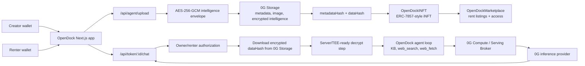

# OpenDock

OpenDock is a decentralized marketplace and execution framework for iNFTs
(Intelligent NFTs) on the 0G Galileo Testnet. It lets creators mint AI agents
whose encrypted intelligence and memory are stored on 0G Storage, then rent or
run those agents through 0G Compute/Serving.

- Live demo: https://opendock.limaois.me
- Public GitHub repo: https://github.com/flyinglimao/opendock
- 0G Galileo chain ID: `16602`

## Submission Details

| Requirement       | OpenDock detail                                                                                                                                |
| ----------------- | ---------------------------------------------------------------------------------------------------------------------------------------------- |
| Project name      | OpenDock                                                                                                                                       |
| Short description | iNFT marketplace and agent framework for minting, renting, chatting with, and automating AI agents whose private intelligence is stored on 0G. |
| Public repo       | https://github.com/flyinglimao/opendock                                                                                                        |
| Live demo         | https://opendock.limaois.me                                                                                                                    |
| Team              | flyinglimao                                                                                                                                    |
| Telegram          | `@flyinglimao`                                                                                                                                 |
| X                 | @billwu1999                                                                                                                                    |

## Contract Deployments

All contracts are deployed on 0G Galileo Testnet.

| Contract                     | Address                                      | Explorer                                                                                   |
| ---------------------------- | -------------------------------------------- | ------------------------------------------------------------------------------------------ |
| `OpenDockINFT`               | `0x3b021DA7A94eD7D4318eA92A0D00520708f1356e` | [View](https://chainscan-galileo.0g.ai/address/0x3b021DA7A94eD7D4318eA92A0D00520708f1356e) |
| `OpenDockMarketplace`        | `0x3663D1eee807Fd0c4B459d855E33cC6326126ea6` | [View](https://chainscan-galileo.0g.ai/address/0x3663D1eee807Fd0c4B459d855E33cC6326126ea6) |
| `TEEVerifier`                | `0x8973A50828CDe59F4EeE69FABcAf6afD8eFAE576` | [View](https://chainscan-galileo.0g.ai/address/0x8973A50828CDe59F4EeE69FABcAf6afD8eFAE576) |
| `AgentComputeWalletDelegate` | `0x8D8b309f02FDD7095085E88407F8FAf2c306283B` | [View](https://chainscan-galileo.0g.ai/address/0x8D8b309f02FDD7095085E88407F8FAf2c306283B) |

Minted example iNFT:
[0xe8f0783f10688885ec2bfd1cfa611282670d0831d7be2eba227cd502dacb4b80](https://chainscan-galileo.0g.ai/tx/0xe8f0783f10688885ec2bfd1cfa611282670d0831d7be2eba227cd502dacb4b80)

Proof that intelligence/memory is embedded on 0G Storage:
[0G Storage submission 79437](https://storagescan-galileo.0g.ai/submission/79437)

The embedded payload is an encrypted OpenDock intelligence envelope. For the
submitted development example, it can be decrypted with the development fallback
key:

```ts
import { createHash } from "node:crypto";

const key = createHash("sha256")
  .update("opendock-development-system-prompt-key")
  .digest();
```

The app encrypts agent intelligence as AES-256-GCM JSON envelopes in
[`lib/encryption.ts`](./lib/encryption.ts), uploads the encrypted envelope to
0G Storage, and stores the resulting 0G root hash in the iNFT
`IntelligentData.dataHash`.

## Protocol Features and SDKs Used

- **ERC-7857-style iNFT private metadata:** `OpenDockINFT` stores public
  metadata separately from private intelligent data hashes.
- **0G Storage:** `@0gfoundation/0g-storage-ts-sdk` and `@0gfoundation/0g-ts-sdk`
  are used to upload agent metadata, images, and encrypted intelligence/memory.
- **0G Compute / Serving:** `@0glabs/0g-serving-broker` is used to discover
  inference providers, obtain request headers, proxy chat completions, and
  settle inference responses.
- **0G Galileo Testnet:** all contracts and storage proofs target chain `16602`.
- **EIP-7702 delegated compute wallets:** OpenDock creates agent/user compute
  wallets that can pay 0G Serving inference fees through a delegated platform
  flow.
- **Marketplace rentals:** `OpenDockMarketplace` lets owners list iNFT agents
  and renters obtain temporary authorized access.
- **Agent tools:** agents can call local knowledge-base tools, Brave Search,
  and URL fetch tools during the 0G-backed chat loop.

## Architecture



OpenClaw integration target: OpenDock exposes the iNFT ownership, rental, and
agent execution layers that OpenClaw-style autonomous workflows can call into.
The integration point is the authenticated agent loop plus 0G-backed
intelligence hash, so an OpenClaw agent can discover an iNFT, verify its
embedded memory on 0G Storage, and execute through 0G Compute.

## Working Example Agent

This example agent can be built with the OpenDock creator flow at `/create`.
It uses the same framework path as production agents: upload metadata and
encrypted intelligence to 0G Storage, mint `OpenDockINFT`, then chat through
0G Compute.

**Agent name:** `0G Research Scout`

**Description:**

```text
Summarizes 0G ecosystem updates, checks fresh sources when needed, and answers
with citations from its knowledge base or web tools.
```

**System prompt:**

```text
You are 0G Research Scout, a concise research agent for the 0G ecosystem.
When a question asks about current information, use web_search first. When the
answer depends on uploaded project notes, use kb_search or kb_read_file before
answering. Always separate confirmed facts from assumptions.
```

**Knowledge base file:** `opendock-notes.md`

```md
# OpenDock Notes

OpenDock mints AI agents as iNFTs on 0G Galileo. Public metadata is stored
separately from encrypted intelligence. Agent intelligence includes the system
prompt and knowledge files, encrypted with AES-256-GCM, uploaded to 0G Storage,
and referenced by the iNFT dataHash.

The runtime decrypts the envelope only after wallet authorization, then runs the
agent loop with knowledge-base search, URL fetch, Brave Search, and 0G
Compute/Serving inference.
```

Programmatic upload path used by the creator UI:

```ts
const form = new FormData();
form.set("name", "0G Research Scout");
form.set(
  "description",
  "Summarizes 0G ecosystem updates with KB and web tools.",
);
form.set("systemPrompt", systemPrompt);
form.set(
  "knowledgeBaseFiles",
  JSON.stringify([
    {
      name: "opendock-notes.md",
      content: knowledgeBaseMarkdown,
    },
  ]),
);

const upload = await fetch("/api/agent/upload", {
  method: "POST",
  body: form,
}).then((res) => res.json());

// upload.metadataHash is passed to OpenDockINFT.mint as token metadata.
// upload.dataHash is passed as IntelligentData.dataHash for encrypted memory.
```

The live implementation is in:

- [`app/create/CreateAgentForm.tsx`](./app/create/CreateAgentForm.tsx)
- [`app/api/agent/upload/route.ts`](./app/api/agent/upload/route.ts)
- [`app/api/token/[id]/chat/route.ts`](./app/api/token/%5Bid%5D/chat/route.ts)
- [`lib/agent-loop.ts`](./lib/agent-loop.ts)
- [`lib/tools/kb.ts`](./lib/tools/kb.ts)

## Features

- Marketplace for browsing, listing, renting, and using AI agents.
- Agent creator for minting iNFT agents with custom prompts, images, and
  knowledge-base files.
- Interactive chat with persistent conversations.
- Tool-calling agent loop with knowledge-base search, web search, and web fetch.
- 0G Storage-backed encrypted intelligence and metadata.
- 0G Compute/Serving-backed inference.
- Cron-style automations for recurring agent tasks.
- Platform/user compute wallet flow for 0G Serving payments.

## Tech Stack

- **Frontend:** Next.js App Router, React 19, Tailwind CSS 4, RainbowKit, Wagmi.
- **Backend:** Next.js API routes, Prisma ORM, PostgreSQL.
- **Smart contracts:** Solidity, Foundry, OpenZeppelin upgradeable contracts.
- **0G:** Galileo Testnet, 0G Storage SDK, 0G TS SDK, 0G Serving Broker.
- **AI/tooling:** OpenAI-compatible chat completions through 0G providers,
  knowledge-base tools, Brave Search, URL fetch.

## Project Structure

- `app/`: Next.js frontend pages and API routes.
- `components/`: shared UI components.
- `contracts/`: Solidity contracts, Foundry scripts, and deployment broadcasts.
- `lib/`: agent loop, 0G Storage helpers, encryption, chain helpers, tools.
- `prisma/`: database schema and migrations.
- `public/`: static assets.

## Setup Instructions

### Prerequisites

- Node.js 20+
- pnpm
- Foundry
- PostgreSQL
- Wallet funded on 0G Galileo Testnet

### Install

```bash
git clone https://github.com/flyinglimao/opendock.git
cd opendock
pnpm install
cp .env.example .env
```

Fill in the required environment variables:

```bash
NEXT_PUBLIC_CHAIN_ID=16602
NEXT_PUBLIC_NFT_ADDRESS=0x3b021DA7A94eD7D4318eA92A0D00520708f1356e
NEXT_PUBLIC_MARKETPLACE_ADDRESS=0x3663D1eee807Fd0c4B459d855E33cC6326126ea6
NEXT_PUBLIC_VERIFIER_ADDRESS=0x8973A50828CDe59F4EeE69FABcAf6afD8eFAE576
AGENT_COMPUTE_WALLET_DELEGATE_IMPLEMENTATION=0x8D8b309f02FDD7095085E88407F8FAf2c306283B
NEXT_PUBLIC_ZG_INDEXER_URL=https://indexer-storage-testnet-turbo.0g.ai
NEXT_PUBLIC_ZG_EVM_RPC=https://evmrpc-testnet.0g.ai
NEXT_PUBLIC_BASE_URL=http://localhost:3000
DATABASE_URL=postgresql://...
OPENDOCK_AGENT_WALLET_MNEMONIC=...
OPENDOCK_AGENT_RELAYER_PRIVATE_KEY=...
TELEGRAM_BOT_TOKEN=...
CRON_SECRET=...
```

For production, set `SYSTEM_PROMPT_KEY` to a random 32-byte key encoded as
64 hex characters. If omitted, local development uses the deterministic fallback
shown in the proof section above.

### Database

```bash
pnpm prisma migrate dev
```

### Run the App

```bash
pnpm dev
```

Open http://localhost:3000.

### Contracts

```bash
cd contracts
forge build
forge test
```

Deployment helpers:

```bash
pnpm contracts:deploy-marketplace
pnpm contracts:authorize-marketplace
pnpm contracts:verify
```

## Security Model

OpenDock currently implements a server-key simulation of the final private iNFT
security model:

- public metadata excludes the system prompt and private memory;
- system prompts and knowledge-base files are encrypted server-side;
- encrypted intelligence is uploaded to 0G Storage;
- only the 0G root hash is stored on-chain as iNFT intelligent data;
- chat endpoints decrypt only after owner/renter authorization checks.

The intended production direction is TEE-based execution, where agent
intelligence can be decrypted and executed without exposing plaintext to the app
server.

## License

MIT. See [`LICENSE`](./LICENSE).
